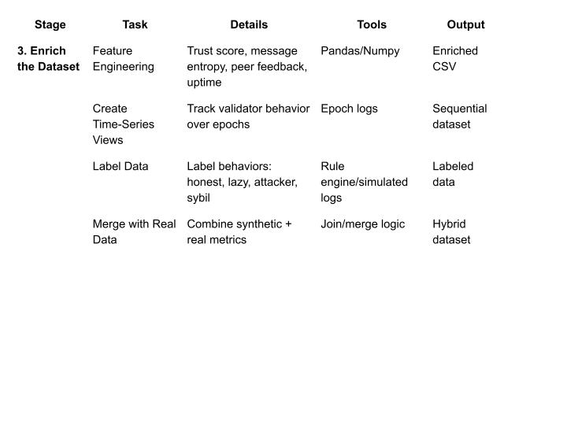

## Research Topic: AI-Driven Validator Selection for Secure Proof-of-Stake Blockchain Networks

### Abstract
Proof-of-Stake (PoS) blockchain networks offer energy-efficient alternatives to Proof-of-Work but remain vulnerable to critical security threats such as long-range attacks, Sybil identities, and the nothing-at-stake dilemma. We propose a novel validator selection framework integrating Multi-Agent Reinforcement Learning (MARL) with Explainable AI (XAI) to enhance security, adaptability, and transparency. Our framework continuously monitors validator behavior in real time and adapts to emerging threats through a learned trust scoring mechanism that incorporates behavioral signals to proactively identify malicious or non-cooperative validators, surpassing reliance on static metrics like stake or uptime. By embedding XAI techniques, the system provides transparent, human-understandable explanations for validator selection and penalty decisions, thereby improving auditability and user trust—challenges not sufficiently addressed in existing AI-driven blockchain approaches. This work contributes a secure, adaptive PoS infrastructure offering real-time monitoring, comprehensive attack defense, and explainable audit trails. Experimental results demonstrate enhanced malicious behavior detection and improved network resilience, all while preserving decentralization and throughput. Our approach aligns with the fundamental blockchain principles of decentralization, resilience, and trustworthiness and lays the groundwork for next-generation PoS validation systems.

### Literature Review
Traditional Proof-of-Stake (PoS) blockchains, such as Ethereum 2.0 and Cosmos, provide improved energy efficiency compared to Proof-of-Work systems but remain vulnerable to several security risks including long-range attacks, Sybil attacks, and the nothing-at-stake problem. Specific attack vectors such as grinding attacks and stake-bleeding have been documented, demonstrating that simple stake-based validator selection mechanisms are often insufficient to ensure robust network security.[1]

Existing PoS networks typically select validators based on stake size or randomized lotteries, sometimes augmented with additional metrics like validator uptime or penalties from slashing events. Several studies have proposed reputation-based systems that incorporate historical validator behavior and peer feedback to discourage malicious actions and enhance fairness in validator selection. However, these reputation mechanisms are frequently static or rule-based which limits their ability to adapt to evolving and novel adversarial behaviors.[2]

Recently, researchers have investigated machine learning methods, especially reinforcement learning (RL), for modeling and identifying malicious behaviors, including Sybil attacks and consensus manipulation in blockchain networks. Although single-agent RL methods have been applied to adaptively modify consensus strategies, they typically struggle with scalability and do not effectively account for the intricate, decentralized interactions occurring among various validators in real-world blockchain environments.[3]

Multi-agent reinforcement learning (MARL) introduces a decentralized paradigm where multiple autonomous agents learn and adapt collectively, offering increased robustness in identifying and mitigating malicious validators. MARL has shown promise across domains featuring large-scale, heterogeneous agent populations and dynamic threat models, making it well-suited to address PoS validator selection challenges. [4]

Despite progress, AI-driven consensus and security systems often act as opaque entities, thereby diminishing transparency, trust, and auditability. Recent studies and surveys have highlighted the essential role of artificial intelligence (XAI) to understand the mechanisms of automation for human stakeholders. Model-agnostic XAI solutions such as SHAP (SHapley Additive Explanations) and LIME (Local Interpretable Model-agnostic Explanations) are increasingly popular for providing advanced insights in complex AI models and enabling users to understand why specific validaters are selected or punished. [5]

Although XAI has achieved notable application in fields such as healthcare and finance, its adoption in blockchain consensus mechanisms and security remains limited. The integration of XAI into validator selection frameworks directly addresses this transparency gap and aligns with emerging calls for explainable, accountable AI governance in decentralized systems.

### Methodology
The present research proposes a comprehensive methodology to develop and assess an AI-driven, explainable validator selection framework for Proof-of-Stake (PoS) blockchain networks. The methodology is structured to address persistent security challenges, including Sybil and long-range attacks, as well as the “nothing-at-stake” dilemma, through the integration of multi-agent reinforcement learning (MARL) and explainable artificial intelligence (XAI) principles.

Initially, empirical data will be gathered from real-world, publicly available PoS blockchain networks, such as Ethereum 2.0, Cosmos, and Polkadot. These datasets will be augmented with synthetic data generated from simulator-driven scenarios, enabling the modeling of both normative and adversarial validator behaviors. Data preprocessing and feature engineering should focus on extracting relevant indicators, including block proposal and attestation histories, slashing events, stake volumes, node uptime statistics, communication patterns, and deviations from expected consensus participation.

A modular, agent-based simulation environment will then be established to replicate PoS network dynamics. This environment faithfully reproduces honest validator behavior and introduces parameterized adversarial actors, simulating attacks under varying network and threat conditions. The simulation framework will be designed to test the robustness and adaptability of the proposed validator selection mechanism under diverse and randomized scenarios.

Central to this methodology is the development of a MARL model, where each validator node is represented as an autonomous agent. The state space for each agent encapsulates historical and behavioral metrics, combined with current network statistics and aggregated peer feedback. Agents select their actions from options such as block proposal participation, attestation, abstention, and communication adjustments. The reward structure encourages honest, continuous participation and accurate identification of malicious activity, while penalizing suspicious conduct, non-participation, and effective attacks. Algorithm selection includes the evaluation of MARL paradigms such as QMIX and Multi-Agent Deep Deterministic Policy Gradient (MADDPG), with agent policies refined through episodic simulation training under escalating adversarial conditions.

A dynamic trust scoring mechanism is layered atop the MARL framework. Each validator’s trust score synthesizes outcomes from the MARL agent’s recent and historical behaviors, including proposal quality, consistency, peer review, and responsiveness to network threats. These scores are used to prioritize validators in future selection rounds, superseding static, stake-only ranking systems and allowing for the proactive exclusion or penalization of suspected adversaries.

To ensure transparency and auditability, explainable AI techniques are applied following the MARL decision processes. Post-hoc analysis tools such as SHAP and LIME are utilized to highlight the primary features and behaviors influencing validator selection and penalty outcomes. Human-interpretable explanations are generated for each significant decision, and a dashboard is proposed to visualize trust evolution, decision rationales, and notable incidents throughout the simulation cycles.

For evaluation, the framework is assessed using comprehensive security, fairness, performance, and explainability metrics. Security is evaluated by measuring the frequency and severity of successful attacks, while fairness focuses on the equitable distribution of validation opportunities across the network. System performance is determined through metrics like confirmation latency and network throughput. The interpretability and usability of explanations are evaluated by means of expert user studies and qualitative audits. Comparative analysis is conducted against traditional selection schemes, such as random, pure stake-based, and uptime-based methods, along with ablation studies to determine the impact of individual framework components.

All code, simulation environments, datasets, and model parameters will be implemented using Python and relevant machine learning and XAI libraries. The full experimental pipeline, including documentation and reproducibility instructions, will be released under an open-source license to facilitate verification and extension by the research community. 

### Dataset

***1. Collect Real-World Data***
We will gather open-source validator data from active Proof-of-Stake blockchains including Ethereum 2.0, Cosmos, and Polkadot. Using public APIs such as Beaconcha.in, Cosmos SDK, Subscan, and platforms like Dune Analytics and Rated.network, we will extract validator behavior logs—covering metrics like uptime, missed attestations, proposal counts, and slashing history. These serve as the foundation of our dataset and reflect actual validator performance in decentralized environments. 

***2. Generate Synthetic Data***
To complement real-world data and introduce labeled adversarial behavior, we simulate a PoS blockchain using agent-based environments (Python + SimPy + NetworkX). We model validators with predefined behaviors such as honest, lazy, selfish, Sybil, and long-range attackers. These synthetic logs are essential for training and benchmarking our AI models, particularly when real-world data lacks explicit behavioral labels. 

***3. Enrich the Dataset***
Next, we enhance the dataset with engineered features like trust scores, message entropy, peer feedback ratings, and consensus deviation. Validators’ actions are tracked over multiple epochs to construct a time-series view. We label behaviors using rule-based heuristics and merge real and synthetic data, creating a hybrid dataset that supports both supervised learning and MARL-based training.

***4. Finalize the Dataset***
In the final stage, we package the dataset with complete metadata, schema descriptions, and licensing. CSVs and JSONs are exported for reproducibility. All fields—such as validator ID, trust score, and behavior class—are clearly documented. The dataset is versioned and published under an open-source license (e.g., CC-BY-4.0) on platforms like GitHub or Zenodo, supporting public reuse and extension by future researchers. 

A detail data collection method is shown below:

***Short Brief***

The flowchart outlines a structured, four-phase pipeline for building a comprehensive dataset to support AI-driven validator selection in Proof-of-Stake blockchain networks. It begins with collecting authentic validator behavior data from multiple live blockchain APIs across Ethereum, Cosmos, and Polkadot. Parallel to this, synthetic data simulating various validator behaviors, including adversarial actions, is generated using agent-based simulations. Both real and synthetic data then undergo feature engineering and integration to create a rich, unified dataset with key metrics such as trust scores and behavioral indicators. Finally, the dataset is thoroughly documented, versioned, and published in open formats to ensure transparency, reproducibility, and community accessibility, ultimately providing a robust foundation for training and evaluating machine learning models in PoS security research.

### Pseudocode:

***Algorithm 1: Hybrid Dataset Construction for PoS Validator Behavior***

Input: Public PoS network APIs; simulator scenario parameters
Output: Hybrid, labeled dataset with engineered features and metadata

1:  Collect-Real()
2:    For each chain in {Eth2, Cosmos, Polkadot}:
3:      Pull validator histories: uptime, proposals, attestations, penalties, stake, latency
4:      Normalize fields; append provenance tags

5:  Simulate-Behaviors()
6:    For profiles in {honest, lazy, selfish, Sybil, long-range}:
7:      Generate episode sequences under varied network/threat params
8:      Emit labeled logs

9:  Unify-and-Label()
10:   Merge real + synthetic logs on validator/time keys
11:   Assign behavior labels via heuristics; retain provenance

12: Feature-Engineering()
13:   Window time-series → missed events, deviation from consensus, entropy, peer feedback
14:   Compute interim trust indicators

15: Finalize-and-Version()
16:   Write tables (CSV/JSON), schema, license
17:   Record dataset version + changelog
  
***Algorithm 2:* MARL-Driven Validator Policy Learning in a PoS Environment**

Input: Hybrid dataset; environment config (validators, epochs, stake distribution)
Output: Trained policies and evolving trust scores

1:  Initialize-Env(N, config)
2:    Create N validator agents with initial stake/trust/uptime/latency

3:  Define-State()
4:    For each agent i: s_i ← features + network stats + peer signals + history

5:  Define-Action-Space()
6:    Actions ← {propose, attest, abstain, adjust-comm}

7:  Define-Reward()
8:    r_i ← reward(honest participation, accurate detection) − penalty(misses, anomalies, slashing)

9:  Train(E episodes)
10:   For e = 1..E:
11:     Reset env; observe S
12:     All agents select actions from policies π_i(s_i)
13:     Step env → S', {r_i}, events
14:     Update policies (e.g., actor-critic / value-based)
15:     Update trust_i using performance signals with bounds/decay
16:     If terminal: break
17:   Checkpoint policies and logs
 
***Algorithm 3:* Trust-Aware Validator Selection with Explainability**

Input: Current features, trust scores, recent policy performance
Output: Selected set 𝑆 and explanations

1:  Rank-Validators()
2:    For each validator v:
3:      score_v ← f(trust_v, recent_performance_v)
4:    Order validators by score_v (desc)

5:  Select-TopK(k)
6:    S ← first k validators

7:  Explain-Selections(S)
8:    For each v ∈ S:
9:      φ_v ← PostHocExplain(features_v, trust_traj_v)
10:     Log {v, score_v, φ_v}

### ***References***
- 1. *S. King and S. Nadal, “PPCoin: Peer-to-Peer Crypto-Currency with Proof-of-Stake,” Aug. 2012.*

- 2. *8M. Saleh, “Blockchain without Waste: Proof-of-Stake,” The Review of Financial Studies, vol. 34, no. 3, pp. 1156–1190, 2021.*

- 3. *Y. Gao, C. Wang, and J. Liu, “Reinforcement Learning-Based Detection of Sybil Attacks in Blockchain Networks,” in Proc. IEEE ICC, 2020, pp. 1–6.*
- 4. *F. H. Bappy, T. Islam, K. Hasan, M. S. I. Sajid, and M. M. A. Pritom, “Securing Proof of Stake Blockchains: Leveraging Multi-Agent Reinforcement Learning for Detecting and Mitigating Malicious Nodes,” in Proceedings of the 2024 IEEE Global Communications Conference (Globecom 2024), 2024*

- 5. *M. Tjoa and R. Guan, “A Survey on Explainable Artificial Intelligence (XAI): Toward Medical XAI,” IEEE Trans. Emerg. Topics Comput. Intell., vol. 5, no. 2, pp. 271–285, Apr. 2021.*

